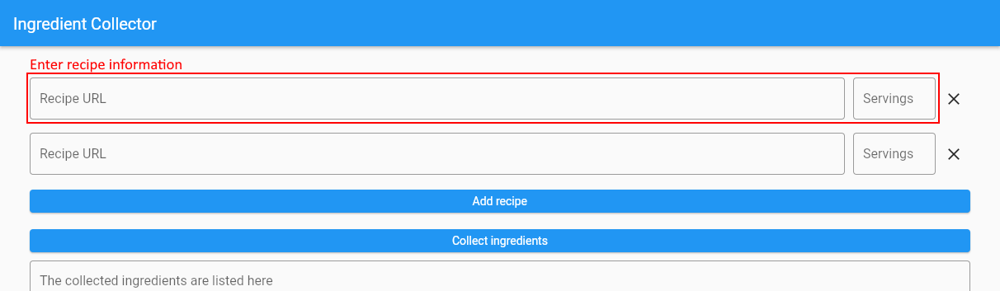
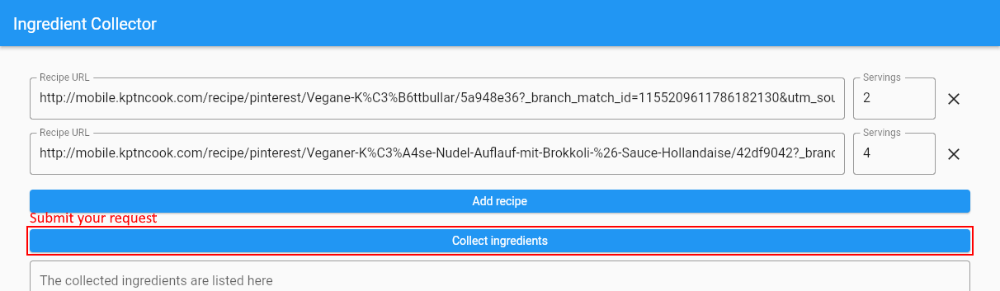
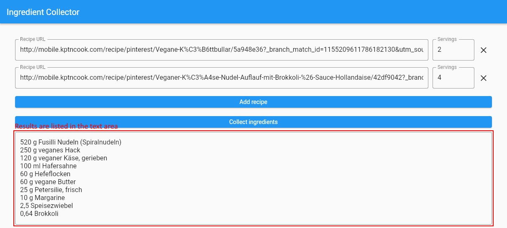

<a name="readme-top"></a>

[](https://codecov.io/gh/Slartibartfass2/ingredient_collector)


[](CHANGELOG.md)
[](https://github.com/Slartibartfass2/ingredient_collector/issues/new/choose "Click to report issue")

<div align="center">
    <a href="https://github.com/Slartibartfass2/ingredient_collector">
        
    </a>
    <h3 align="center">ingredient_collector - 0.8.0</h3>
    <p align="center">
        An app that collects ingredients from recipe websites and combines them into a shopping list.
    </p>
    <a href="https://slartibartfass2.github.io/ingredient_collector/"><strong>Test it out »</strong></a>
    <br/>
    <br/>
    <a href="https://github.com/Slartibartfass2/ingredient_collector/issues/new?assignees=Slartibartfass2&labels=bug&template=bug_report.yml&title=%5BBug%5D%3A+%3Ctitle%3E">Report Bug</a>
    <a href="https://github.com/Slartibartfass2/ingredient_collector/issues/new?assignees=Slartibartfass2&labels=enhancement&template=feature_request.yml&title=%5BFeature%5D%3A+%3Ctitle%3E">Request Feature</a>
</div>

<details>
    <summary>Table of Contents</summary>
    <ol>
        <li>
            <a href="#about-the-project">About The Project</a>
            <ul>
                <li><a href="#built-with">Built With</a></li>
            </ul>
        </li>
        <li>
            <a href="#getting-started">Getting Started</a>
            <ul>
                <li><a href="#prerequisites">Prerequisites</a></li>
                <li><a href="#installation">Installation</a></li>
            </ul>
        </li>
        <li><a href="#usage">Usage</a></li>
        <li><a href="#roadmap">Roadmap</a></li>
        <li>
            <a href="#contributing">Contributing</a>
            <ul>
                <li><a href="#adding-support-for-a-recipe-website">Adding support for a recipe website</a></li>
            </ul>
        </li>
        <li><a href="#releasing">Releasing</a></li>
        <li><a href="#license">License</a></li>
    </ol>
</details>

## About The Project

**ingredient_collector** uses HTTP requests to collect the ingredients of a recipe website and combines them into a shopping list.

### Built with

- [![Flutter][flutter-icon]][flutter-url]

<p align="right">(<a href="#readme-top">back to top</a>)</p>

## Getting Started

### Prerequisites

1. [Install flutter](https://docs.flutter.dev/get-started/install)

2. Run `flutter doctor -v`

3. Make sure there is no category with an error.

### Installation

1. Clone the repo

    ```sh
    git clone https://github.com/Slartibartfass2/ingredient_collector.git
    cd ingredient_collector
    ```

2. Run setup file

    On Windows run:

    ```sh
    .\setup.ps1
    ```

    On Linux/macOS run:

    ```sh
    bash setup.ps1
    ```

3. Run it on your preferred device

    ```sh
    flutter run -d <device-id>
    ```

    You can list all available devices using

    ```sh
    flutter devices
    ```

4. Run the following commands to build the release version

    - For the Web release run:

        ```sh
        flutter build web --base-href="/ingredient_collector/"
        ```

        [More information on releasing for Web](https://docs.flutter.dev/get-started/web)

    - For the Windows release run:

        ```sh
        flutter build windows
        ```

        [More information on releasing for Windows](https://docs.flutter.dev/development/platform-integration/windows/building)

    - For the Android release run:

        ```sh
        flutter build apk
        ```

        [More information on releasing for Android](https://docs.flutter.dev/deployment/android)

<p align="right">(<a href="#readme-top">back to top</a>)</p>

## Usage

1. Enter recipe information.
   

2. Submit your request.
   

3. Results are listed in the text area.
   

4. Now you can copy the ingredients to your note app e.g. Google Keep.

<p align="right">(<a href="#readme-top">back to top</a>)</p>

## Roadmap

- [x] Add support for [KptnCook](https://www.kptncook.com/)
- [x] Add support for [Eat This](https://www.eat-this.org/)
- [x] Add support for [Bianca Zapatka](https://biancazapatka.com/de/)
- [x] Add support for [Chefkoch](https://www.chefkoch.de/)
- [x] Add support for [Nora Cooks](https://www.noracooks.com/)
- [ ] Add support for [BBC Good Food](https://www.bbcgoodfood.com/)

See the [open issues](https://github.com/Slartibartfass2/ingredient_collector/issues) for a full list of proposed features (and known issues).

<p align="right">(<a href="#readme-top">back to top</a>)</p>

## Contributing

Contributions are what make the open source community such an amazing place to learn, inspire, and create. Any contributions you make are **greatly appreciated**.

If you have a suggestion that would make this better, please fork the repo and create a pull request. You can also simply open an issue with the tag "enhancement".
Don't forget to give the project a star! Thanks again!

1. Fork the Project
2. Create your Feature Branch (`git checkout -b feat/AmazingFeature`)
3. Commit your Changes (`git commit -m 'feat: Add some AmazingFeature'`)
4. Push to the Branch (`git push origin feat/AmazingFeature`)
5. Open a Pull Request

### Adding support for a recipe website

1. Add a new parser in [./lib/src/recipe_parser/](./lib/src/recipe_parser/) extending [RecipeParser](./lib/src/recipe_parser/recipe_parser.dart) as part of `recipe_parser`.

    ```dart
    part of 'recipe_parser.dart';

    class ExampleParser extends RecipeParser {
      const ExampleParser();

      @override
      RecipeParsingResult parseRecipe(
        Document document,
        RecipeParsingJob recipeParsingJob,
      ) {
        ...
      }
    }
    ```

2. Declare the new parser in [./lib/src/recipe_parser/recipe_parser.dart](./lib/src/recipe_parser/recipe_parser.dart)

    ```dart
    library recipe_parser;

    part 'example_parser.dart';

    ...
    ```

3. Add the new supported website in [./lib/src/recipe_controller/recipe_website.dart](./lib/src/recipe_controller/recipe_website.dart).

   ```dart
   exampleWebsite("https://www.example.org", ExampleParser());
   ```

4. Add tests in [./test/recipe_parser_tests/](./test/recipe_parser_tests/) to ensure the parsing works.

<p align="right">(<a href="#readme-top">back to top</a>)</p>

## Releasing

1. Change version in [pubspec.yaml](pubspec.yaml)
2. Change version in [README.md](README.md)
3. Add changelog entry in [CHANGELOG.md](CHANGELOG.md)

## License

Distributed under the GPLv3 License (before v0.8.0 under MIT). See [LICENSE](LICENSE) for more information.

<p align="right">(<a href="#readme-top">back to top</a>)</p>

[flutter-icon]: https://img.shields.io/badge/flutter-%230175C2.svg?style=for-the-badge&logo=flutter&logoColor=white
[flutter-url]: https://flutter.dev/
